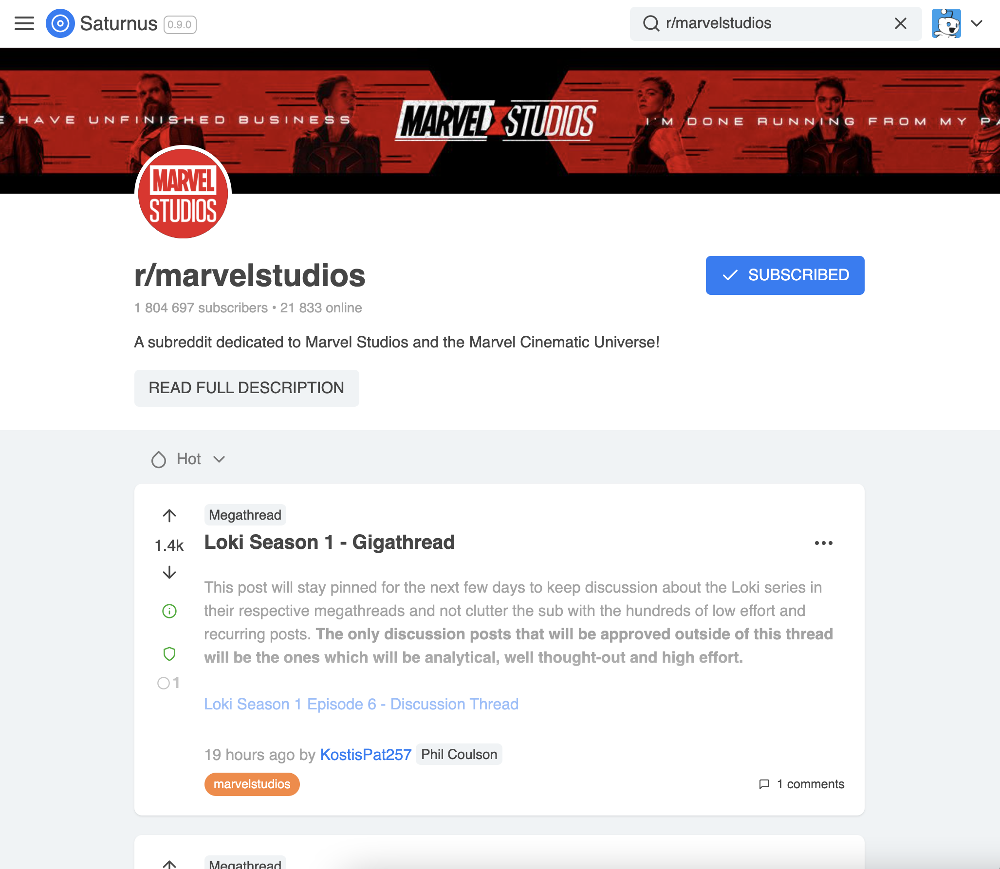

# Saturnus is unmaintained!

_I'm super busy with my job nowadays so unfortunately I won't have time to work on this project at the moment. It's still deployed and usable! But don't expect any new features or fixes in the near future._

_I've improved my front-end skills a lot since starting this project, so rather than continuing to build on this pile of spaghetti code, I will likely do a rewrite in another repo._

# Saturnus

A work in progress browser client for Reddit.

<p align="center">

</p>

Ever since the new Reddit was launched, many users have voiced their dislike of how clunky it feels. The aim of this project is to create a more light-weight Reddit experience, taking inspiration from the great iOS app Apollo for Reddit, Facebook, and Twitter.

[Try it here!](https://saturnusapp.com/)

## Develop locally

This section describes how to set up the project to develop on your local computer. You need **Node.js** and **npm** installed on your computer.

### Reddit API

This project uses Reddit's API. If you want to develop locally or deploy your own version, you need to go [here](https://ssl.reddit.com/prefs/apps/) and create a new web app. You should then copy `.env.example` into a new file `.env` and add your Reddit Client ID.

For myself, I have actually set up **two** "reddit apps": one where the redirect uri is `http://localhost:3000` for my local development and the other whose redirect uri is `https://saturnusapp.com` for the deploy environment.

### Initial setup

Assuming you have set up your `.env` file, follow the below steps:

Install dependencies:

```
$ npm install
```

Start local development:

```
$ npm start
```

Your local app should now be running on `http://localhost:3000`!

## Build and deploy

This repo is connected to **Netlify** which automatically builds and deploys from the `master` branch.

To build and deploy in some other way, follow the same steps as the set up for local development, up until the `npm start` command. Then, run the following command:

```
$ npm run build
```

This will compile all code and put it into the `/build` folder. You can now use any static website hosting to deploy this folder, for example with your own Netlify setup or a remote server with nginx or something!

## Helpful editor extensions

Throughout this project, I organize content within files by using comments like this:

```js
// MARK: Helper functions

function thing() {}
```

This is actually a convention I learned in Swift, but I've found it useful in JS as well. I recommend the VS Code extension [TODO Highlight](https://marketplace.visualstudio.com/items?itemName=wayou.vscode-todo-highlight) with the following config:

```json
"todohighlight.keywords": [
    {
      "text": "MARK:",
      "isWholeLine": true,
      "backgroundColor": "lightblue",
      "color": "#ffffff"
    }
  ]
```

This config will highlight the lines that contain the MARK comments. Obviously, you can use any other colors if you prefer.
